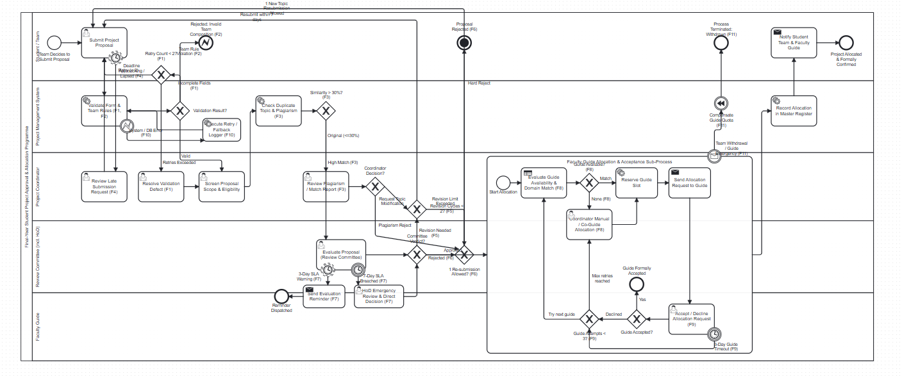
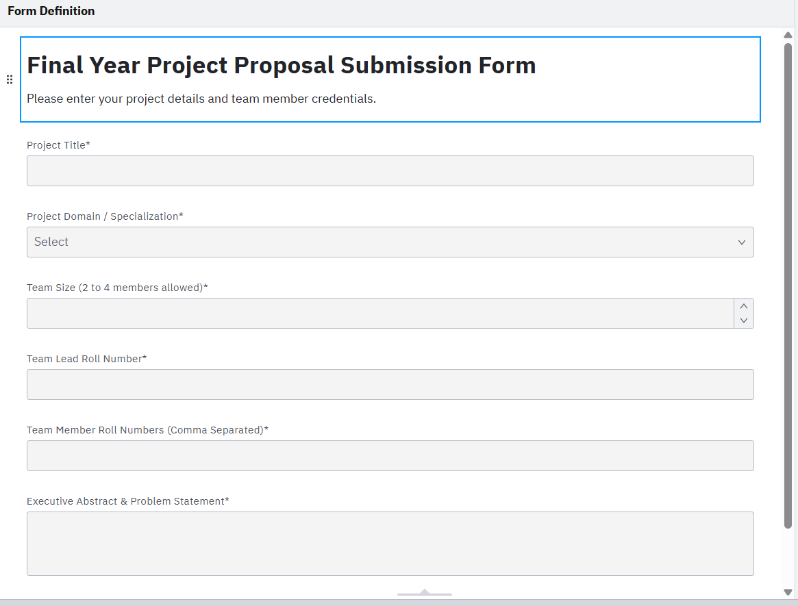
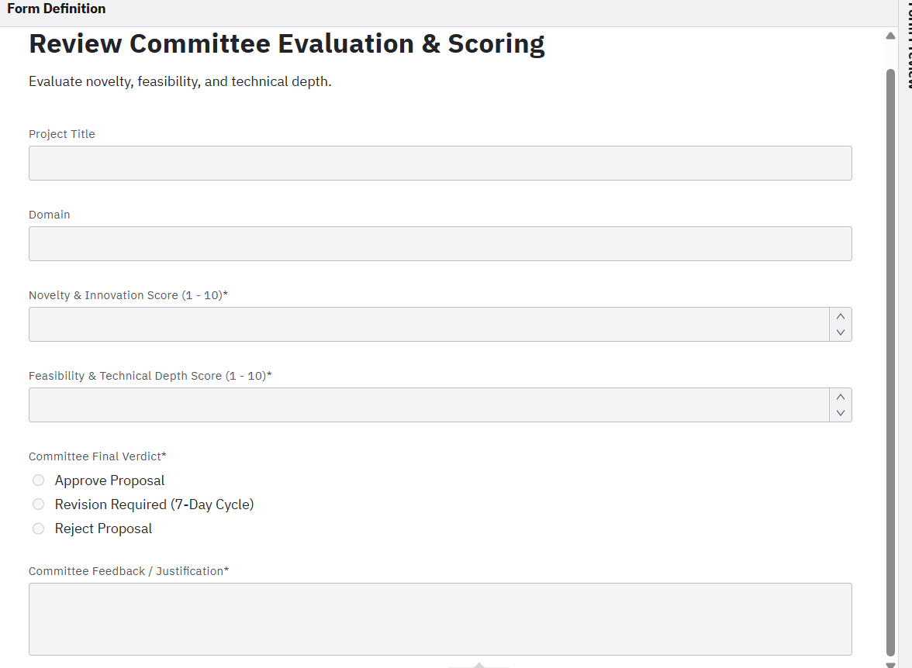
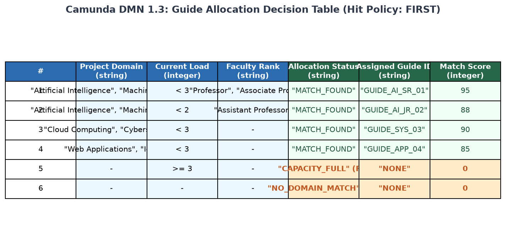
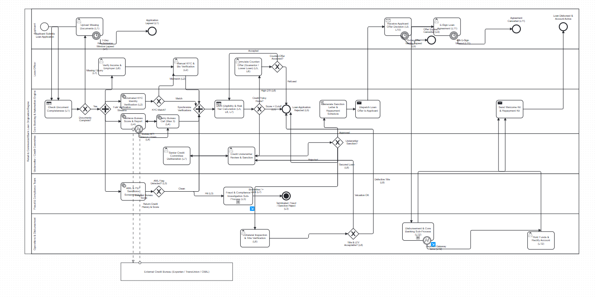
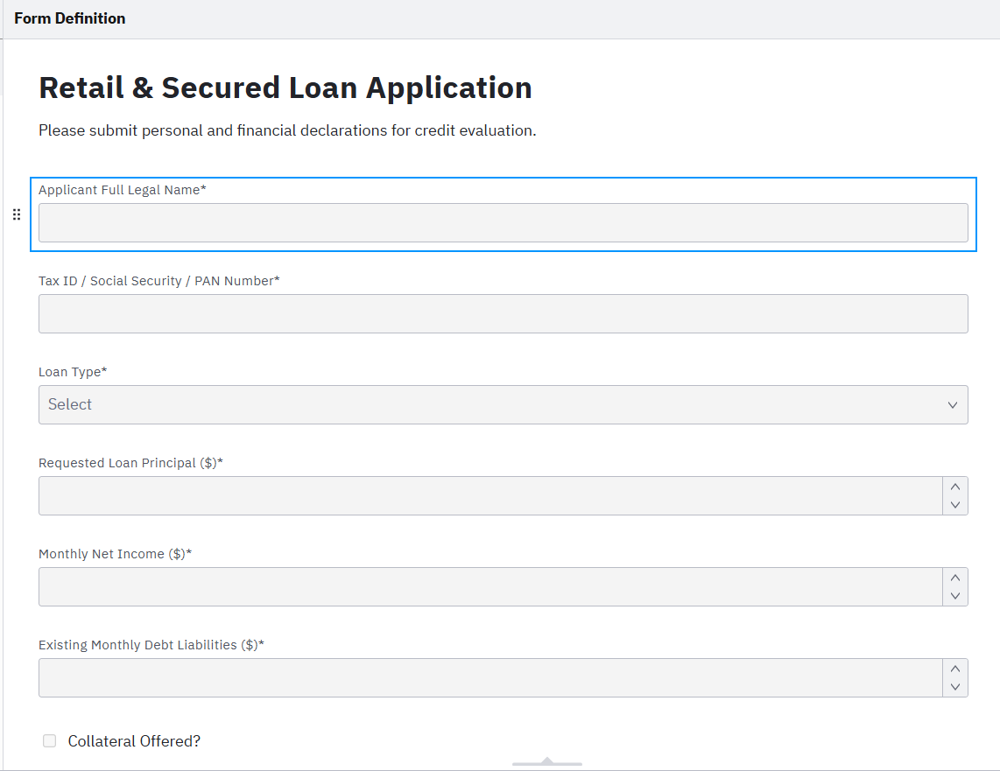
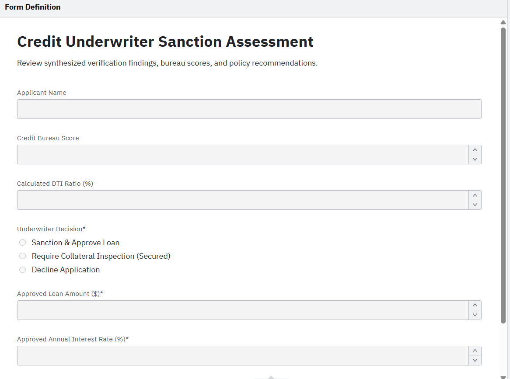

# Workflow Automation - Assignment 3

This repository contains my submission for Assignment 3 in the Workflow Automation course. All workflows, decision tables, and user forms were created in **Camunda Modeler**.

From the assignment sheet, I selected the following two topics:
1. **Assignment 1: Student Project Approval & Allocation System**
2. **Assignment 3: Loan Origination & Approval System**

Below are the complete explanations, screenshots from Camunda Modeler, and details on how the happy paths and all failure cases are handled.

---

## Assignment 1: Student Project Approval & Allocation System

### 1. Process Overview & Participants
This process manages how final-year engineering students submit capstone project proposals, how the department reviews them, and how faculty guides are matched and allocated.

The workflow is modeled in a collaboration pool with 5 lanes:
- **Student / Team**: Submits the proposal, resubmits if validation fails or revisions are needed, and gets the final allocation letter.
- **Project Management System**: Performs automated checks (form field validation, team size 2–4, student uniqueness across teams), runs plagiarism/similarity scans, and executes the guide allocation rules.
- **Project Coordinator**: Screens proposals for prerequisites, reviews similarity flags, approves late submissions, and steps in for manual allocation if automated matching fails.
- **Review Committee (incl. HoD)**: Evaluates the project for novelty and feasibility, and decides whether to approve, request revisions, or reject.
- **Faculty Guide**: Receives the allocation request, reviews team details, and accepts or declines the mentorship within a sub-process.

---

### 2. BPMN Process Diagram
Here is the complete BPMN 2.0 workflow diagram modeled in Camunda Modeler:

### Walkthrough & Explanation of the Diagram:
- **Starting the Process**: The process starts when a student team initiates a proposal submission. They enter their title, domain, team size, roll numbers, and abstract using a user task (`student_proposal_form.form`).
- **Deadline Boundary Timer (F4)**: A 14-day non-interrupting timer boundary event is attached to the submission task. If the deadline approaches or passes before submission, it flags the team and routes to the coordinator's lane to review and approve late submissions.
- **Form & Team Rule Validation (F1 & F2)**: A system service task validates the input. An exclusive gateway evaluates the result:
  - If team rules are violated (e.g. size < 2 or > 4, or a student is already on another team), it branches to an Error End Event (`Rejected: Invalid Team Composition - F2`).
  - If required fields are missing, it loops back to the student. A retry counter gateway checks if attempts are under 2 (`F1`). If repeated attempts fail, it escalates to the coordinator to resolve the defect.
  - If valid, the proposal proceeds to the coordinator for scope screening.
- **Similarity & Duplicate Check (F3)**: A service task compares the topic against previous years' project archives. If similarity exceeds 30%, the coordinator reviews the match report and either requests a modified topic (looping back to submission) or rejects it.
- **Review Committee Evaluation (F5, F6, F7)**:
  - The review committee evaluates the proposal using `committee_evaluation_form.form`.
  - **SLA Boundary Timers (F7)**: A 3-day non-interrupting timer sends a reminder alert to the panel. A 7-day interrupting timer escalates the evaluation directly to the Head of Department (HoD) for an emergency review and binding verdict.
  - **Committee Verdict Gateway**:
    - **Approved**: Moves directly to the guide allocation sub-process.
    - **Revision Required (F5)**: An exclusive gateway checks if revision cycles are under 2. If so, the team enters a 7-day revision loop. If 2 cycles are already exceeded, it routes to rejection.
    - **Rejected (F6)**: The team is notified with feedback. If it is their first rejection, they are allowed 1 fresh topic resubmission. If they fail again, it terminates at a Terminate End Event.
- **Guide Allocation Sub-Process (F8, F9, F11)**:
  - Inside the sub-process, a Business Rule task calls `guide_allocation_rules.dmn`.
  - If an eligible guide with open capacity (< 3 teams) is found, a slot is reserved and an allocation request is sent to the guide.
  - If no guide is available (`F8`), it routes to the coordinator for manual allocation, assigning an external mentor, or placing the team on a priority waitlist.
  - The faculty guide reviews the request via a user task. A 3-day timer boundary event (`F9`) handles non-responsive guides. If declined or timed out, the system excludes that guide and retries matching (up to 3 attempts, after which the coordinator assigns manually).
  - **Withdrawal & Compensation (F11)**: A boundary message event is attached to the sub-process. If the team disbands or the guide goes on leave after approval, a compensation event frees up the guide's quota slot and closes the process as withdrawn.
- **Completion**: The system records the allocation in the master database, dispatches official confirmation letters to the team and guide, and ends at "Project Allocated & Formally Confirmed".

---

### 3. User Forms for Assignment 1

#### Student Proposal Submission Form
Used by the student team at the start of the process:

This form captures the project title, domain/specialization (AI/ML, Cloud, IoT, Web Apps), team size (enforcing 2 to 4 members), team lead roll number, member roll numbers, and abstract.

#### Review Committee Evaluation Form
Used by committee members during technical review:

This form displays the submitted title and domain (read-only), captures scores for novelty (1–10) and feasibility (1–10), collects the verdict (Approve, Revision Required, Reject), and requires committee feedback notes.

---

### 4. DMN Decision Table: Guide Allocation Rules
Here is the decision table created in Camunda Modeler for guide matching:

- **Hit Policy**: `FIRST`
- **Inputs**: `projectDomain` (string), `guideCurrentLoad` (integer), `facultyRank` (string)
- **Outputs**: `allocationStatus` (string), `assignedGuideId` (string), `matchScore` (integer)
- Rules 1 to 4 check domain matching for AI/ML, Cloud, and Web/IoT against guide capacity (< 3 teams).
- Rule 5 catches when matching guides are full (>= 3), returning `CAPACITY_FULL`.
- Rule 6 is the fallback for unmatched domains, returning `NO_DOMAIN_MATCH`.
- Both fallback rules route to the coordinator for manual allocation in the BPMN model (`F8`).

---

### 5. Failure Path Register (F1 – F11)

| ID | Failure Point | Cause / Trigger | Solution & BPMN Construct | Limit / SLA |
| :--- | :--- | :--- | :--- | :--- |
| **F1** | Proposal validation | Missing fields or invalid roll numbers | Exclusive gateway returns proposal with error list; student resubmits. Retry counter limits attempts before coordinator escalation. | Max 2 retries |
| **F2** | Team rule check | Team size < 2 or > 4, or student already in another team | Exclusive gateway routes to Error End Event (`Invalid Team`); team must reform. | Immediate stop |
| **F3** | Duplicate / plagiarism | Similarity score > 30% against archive | Exclusive gateway routes match report to coordinator to request topic modification or reject. | > 30% threshold |
| **F4** | Proposal deadline | Team misses submission cutoff | Non-interrupting timer boundary event (14 days) alerts coordinator to review late submission. | 14 days timer |
| **F5** | Revision request | Objectives vague, novelty weak | Exclusive gateway routes to 7-day revision loop. Counter enforces maximum cycles. | Max 2 cycles |
| **F6** | Committee rejection | Topic unfeasible or out of syllabus | Feedback sent to team. Exclusive gateway allows 1 fresh topic resubmission attempt. | 1 resubmission |
| **F7** | Review delayed | Committee misses SLA | Dual boundary timers: 3-day reminder alert; 7-day timer escalates directly to HoD. | 3D / 7D timers |
| **F8** | No guide available | Domain mismatch or all guides at capacity | DMN returns none; exclusive gateway routes to coordinator for manual allocation or waitlist. | Immediate fallback |
| **F9** | Guide declines or silent | Guide declines or misses 3-day window | 3-day timer boundary event + decline path excludes guide and retries allocation (max 3 times). | 3D timer, 3 tries |
| **F10** | System / DB failure | Database error or email failure | Error boundary event triggers retry task (up to 3 times) before logging error for admin. | 3 retries |
| **F11** | Withdrawal | Team disbands or guide takes leave | Boundary message event on sub-process triggers compensation to release guide slot. | Pre-registration |

---

## Assignment 3: Loan Origination & Approval System

### 1. Process Overview & Participants
This workflow models a bank's retail and secured loan origination process, from customer application through parallel verifications, risk underwriting, offer acceptance, and CBS disbursement.

I modeled this using two collaboration pools:
1. **Bank Loan Origination Engine** (with 6 lanes):
   - **Applicant**: Submits the loan application, uploads missing documents, accepts the sanction offer, and e-signs the agreement.
   - **Loan Officer**: Resolves KYC/biometric mismatches, verifies salary and employment, and structures counter-offers.
   - **Core Banking & Automation Engine**: Handles document checks, orchestrates credit bureau APIs, runs the DMN scoring table, generates offers, and sends notifications.
   - **Underwriter / Credit Committee**: Reviews risk dossiers and makes sanction decisions.
   - **Fraud & Compliance Team**: Investigates sanctions and AML alerts and files regulatory SAR reports.
   - **Operations & Disbursement**: Conducts collateral/property due diligence, performs account penny-drop checks, and executes funds transfer.
2. **External Credit Bureau** (Experian / CIBIL / TransUnion):
   - External pool connected via asynchronous BPMN message flows (`MsgFlow_BureauRequest` and `MsgFlow_BureauResponse`).

---

### 2. BPMN Process Diagram
Here is the complete BPMN 2.0 workflow diagram modeled in Camunda Modeler:

### Walkthrough & Explanation of the Diagram:
- **Application Submission**: The applicant fills in personal details, loan product type, requested amount, monthly income, and existing debt through a user task form (`loan_application_form.form`).
- **Document Completeness Check (L1)**: A business rule task checks that identity proof, income slips, and bank statements are provided. An exclusive gateway handles incomplete documents by routing back to the applicant with a 7-day timer boundary event (`L1`). If the timer expires without upload, the application lapses.
- **Parallel Verification Streams**: A parallel split gateway forks into 4 concurrent checks:
  1. Automated KYC identity verification service task (`L2`). If biometric or identity details mismatch, it routes to the loan officer for manual verification.
  2. External Credit Bureau score retrieval service task (`L4`). Connected via message flows to the external bureau pool. An error boundary event handles API timeouts with up to 3 automatic retries, falling back to manual officer lookup if the bureau remains down.
  3. Employment & Income verification user task handled by the loan officer (`L6`).
  4. Automated AML & Sanctions screening service task (`L3`). If a hit occurs, it routes to a Fraud Investigation sub-process, files a SAR report, and ends with a Terminate End Event to kill all parallel tokens.
- **Parallel Join**: A parallel join gateway synchronizes all 4 streams before moving forward.
- **DMN Risk Scoring & Routing**: A business rule task evaluates `loan_eligibility_rules.dmn`. An exclusive gateway branches based on policy:
  - **Standard Underwriting**: Routes to the underwriter user task (`underwriter_review_form.form`).
  - **High Value / Borderline (L7)**: Routes to the Senior Credit Committee with a 48-hour SLA timer.
  - **Elevated DTI / Low Credit (L5 & L6)**: Routes to the loan officer to structure a counter-offer (requesting a guarantor or reducing the loan amount). The applicant can accept (loops back to re-scoring, limited to 1 cycle) or decline (rejection).
  - **Direct Reject**: Fails minimum policy; sends adverse action letter.
- **Collateral Due Diligence (L8)**: For secured loans, the underwriter routes the case to operations for property inspection and title verification. Title defects cause immediate rejection. Lower appraisals reduce the loan-to-value (LTV) ratio and return to the underwriter to adjust the loan amount.
- **Offer Generation & Acceptance (L9, L10)**:
  - A script task generates the sanction ID and repayment terms. A send task dispatches the offer letter to the applicant.
  - The applicant receives the offer in a receive task. A 15-day interrupting timer boundary event (`L9`) expires the offer if not accepted in time.
  - **Withdrawal & Compensation (L10)**: A boundary message event allows the applicant to withdraw before disbursement, triggering a compensation event that refunds processing fees and releases collateral holds.
- **E-Signing (L11)**: The applicant digitally signs the agreement. A 48-hour timer boundary event cancels the offer if unsigned.
- **Disbursement Sub-Process (L12)**:
  - Executes penny-drop account validation, creates the loan master account in CBS, and transfers funds via NEFT/RTGS.
  - An error boundary event catches payment gateway failures, holds funds in escrow, halts CBS bookings, and alerts operations to rectify account details.
- **Completion**: The system sends a welcome kit and repayment schedule, ending at "Loan Disbursed & Account Active".

---

### 3. User Forms for Assignment 3

#### Retail & Secured Loan Application Form
Used by the applicant to submit loan details:

This form collects applicant legal name, tax ID / SSN, loan product type (personal unsecured, mortgage secured, commercial), requested principal amount, monthly net income, existing debt liabilities, and whether collateral is offered.

#### Credit Underwriter Sanction Assessment Form
Used by the credit underwriter to evaluate the dossier and sanction terms:

This form displays the applicant name, bureau score, and calculated DTI ratio (read-only), provides decision options (Sanction & Approve, Require Collateral Inspection, Decline Application), and captures approved loan amount, interest rate, and underwriter notes.

